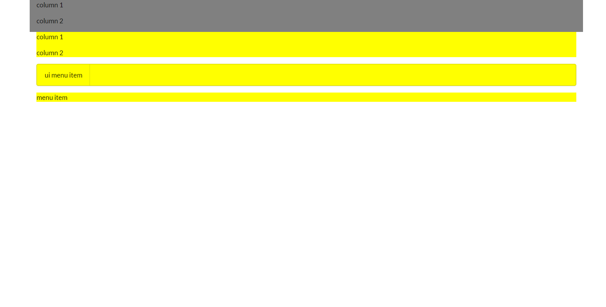
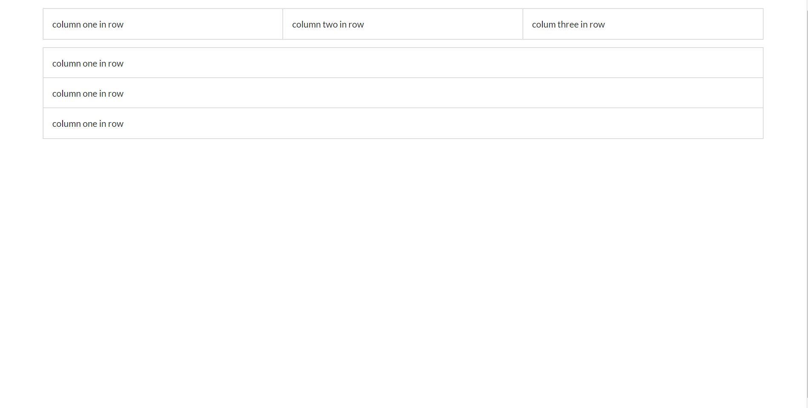

If you are a programmer or just started to learn a programming language, you have probably thought about becoming a web developer or at least thinking about making money with it. I'm not a big fan of script languages such as HTML, CSS, and Javascript. script languages are relatively easy to start with but it is also hard to manipulate its components. It might take you few hours to learn HTML/CSS and Javascript but it would take years of experience to become an expert web developer. What if someone like me who doesn't have much time to spend on web development and wants to make a website? You just have to use a good library that thousands of people spent thousands of time on making a responsive web development like the popular library, Semantic UI. there are many UI Framework libraries but today I would give you a gist of what UI Framework library can do with Semantic UI in beginner's perspective (because I'm the beginner).

First off, You need to know some of the HTML elements. by using Semantic UI for couple days, I realized you don't need to use all the HTML elements by the specific situation. I know you just want to read tedious explanation so I'll just start with HTML elements that you will need for now.

 - this is the most essential element and you will use for almost everything.

<a> - this is link element that user can click. it could refer to other website or make something to pop up.

 - paragraph element. it's just for text.

<h1> - header element. Big and Thick text for header.

<i> - icon element. you can use 
 but just for visibility, use this for icon.

I will assume, you already know how to add Semantic UI into your HTML (if not check this link https://semantic-ui.com/introduction/getting-started.html) and start with basic components.

The first element you need to know is a container. A container is an element designed to contain page elements to a reasonable maximum width based on the size of a user's screen. Since screen size of devices is various, it is good to a good idea to wrap elements with a container element. If you want to check how it works, adds 'container' in the class in any HTML element and resize your browser, it will resize your component as it gets smaller.

ui class was the most confusing component to understand and still is pretty ambiguous to me since I'm not an expert. In the Semantic UI description, ui is a special class name used to distinguish parts of components from components. so basically its better to add ui class in the outer most wrapper that distinguishes one group of elements. every ui class differs by every component but basically, it just changes margins, padding, borders, and other layouts depend on following elements. 

as shown above, it changes the layout of the element. I wouldn't think about it too much since its complicated, but try to add ui class if it's outer most wrapper because it looks definitely better than flat and plain layout. 

grid, row, and column are the most important element, in my opinion, and would make your web development a lot easier. you could already be guessed that those components are exactly like a spreadsheet. the grid class contains row and column. rows could be in a column and also columns could be in a row. grid class is good for dividing sections. elements in rows will be aligned horizontally and elements in columns will be aligned vertically as shown below. 

when you are designing layout. it's better to start with a row inside of the grid because when you start with a column, you could easily lose what you are doing and left to right horizontal elements are natural since we read left to right. and then you can add vertical column inside of the row to make elements aligned vertically. 

now you know how to align elements vertically and horizontally. this grid, row, and column would make help you start how to design a website with Semantic UI. try different elements and try to copy(just for exercise) a website. Remember. Grid > Row > Column. you would find these orders are very useful.
