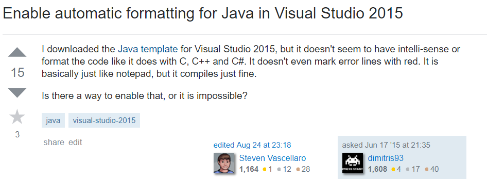

<b>Introduction</b>

It was a normal day of attending school, The president of Grey Hat Organization came to promote the recruitment of new members in my two ICS (Information and Computer Sciences) classes in one day. GHO Practices cyber defense and technology to understand and prevent cyber attacks. This organization is highly active in the community and, despite its subject, it's open to any students who are interested in cybersecurity. However, this organization is only well known among ICS students, like me, who has heard their activities and it's the only organization I know in the UH Manoa although The University of Manoa provides more than 200 current Registered Independent Organizations (RIOs). This experience of ours shows that the organizations are highly segregated by its subject and community and most of the students are unaware of its existence although many organizations are open to anyone. We, Squadify Organization, wanted to provide the easy way to find about Registered Independent Organizations and its activities to all students who have the same interest regardless of their professions. 

<b>Squadify Overview</b>

Squadify is the simple informational website that provides information and activities of Registered Independent Organizations (we call it squads). UH students who want to find information of squads can go to Squadify webpage and explorer all existing squads. Currently, Squadify provides 50 RIOs in UH Manoa and searching by interest for users who want to find the squad they are interested in.

Squadify provides three-way to enter squad page which is spotlight, search, and list. 
The squad spotlight is randomly chosen and shown from the list of RIOs so that students can take a chance to look at the variety of squads in different interest and area.
The search bar is located on the top and the bottom for quick search. The user can search squads by name or interest and it will redirect the page to search page with squad pages links that match the search words. 
List page contains the list of all registered squads. If a user wants to see all squad in UH, they can go to list page and take a quick look.

Once user found the squad and enter to the squad page, they can see the brief information. It consists of a slideshow of pictures, summary, and information. This page gives the user the gist of the squad so that the user can see what they are. For simplicity and convenience, this page only provides few pictures and one summary. The squad member who is authorized to edit page has responsible to hook possible new squad member and students who are interested can visit their media and contact the squad member for more information.

 If you are authorized squad member, edit club navigation link would be shown on the menu. Once you click desire squad you want to edit, it will lead to squad edit page. 
The squad edit page allows authorized squad member to edit their squad information that will show on their squad page. All data has already in the database will be pre-loaded to the page for the convenience purpose. The squad member can change their name, leader, tags, summary, and media information. Adding pictures are only allowed by url. all the changes will be updated once update button is clicked and Delete button will delete the squad page entirely. 

Adding new squad is only authorized to admins. If you are authorized admin, add club navigation link will show up in the navigation and it will lead you to the create squad form. Everything is same as on the edit page except it will be an empty form. once you filling out the form and click create button, it will create the squad page and save information in the database.

<b>Contribution in Squadify</b>

My contribution to the Squadify project is squad page, edit squad page, and add squad page. All user interfaces are designed with Semantic UI. All data are synchronized with MongoDB and components are dynamically generated with the Blaze such as slideshow and media information.

The edit page provides authorized members to edit their squad page. This page pre-loads current data in the database so the member can see current data of the squad page. If the member wants to add more picture, they can put URL of the picture and add into the list above. It will dynamically add URL to the list and show on the page. All changes will be updated once they click the update button. It will push the picture URLs to the database and update rest of the information. The delete button will remove the squad database entirely

The add squad page's UI is basically the same as edit page. only difference is, it's empty form and it creates and inserts new squad database once admin presses the create button. 

<b>Learning experience</b>

This project has proceeded with the Meteor that contains Blaze, MongoDB, Semantic UI and fundamental web programming skill such as HTML, CSS, and Javascript. Fortunately, I have the chance to learn all of the skills required. However, There were many issues with passing and connecting data across one to another. for example, the slideshow had to retrieve pictures URL from MongoDB respected to the squad id. I have experience making database but I had never tried to retrieve and modify the data from outside of the database. I had spent so much time on figuring out why data only get retrieved in the {{ each }} loop. turns out,  {{ each }} loop takes cursor and converts to object and runs the loop so when I was using {{ if }} statement, it couldn't retrieve one data from the cursor because it doesn't convert it. I spent hours to make cursor to an object and turns out, Underscore can find specific data and returns in an object. This experience taught me how important it is to understand how it's structured and working along.

while searching and understanding how everything works together, I realized code doesn't help me understand how things work. I had a problem understanding routing with Flowrouter and _id, I was analyzing the example codes on the website but I couldn't understand how it works. I couldn't figure out how to make it work until I read different design patterns. It was brief summary of different design pattern. It took less than an hour to read but it helped me understanding codes and the proper way to approach the problem. of course, I had a lot of problem with codes but the time I had to spend to solve was tremendously lesser because I know what question I have to ask.

Lastly, I learned how to work with group members and why we have to work together. We had a lot of conflict during the development and we didn't go along as a group. Most of the time, we worked by ourselves and briefly met once or twice a week for progress status. A week before the deployment, We sat and worked together for couple hours. I had an issue with getting specific tag data from HTML to Javascript. I was frustrated with the problem that I couldn't make any progress until one of the members had taken a look and solved the problem in less than an hour that I had for two days. Later that day before we leave, the member told me he had a problem with Semantic UI functionality for a whole day and fortunately, I was able to help him in short time. That day, I realized sitting and working together boosts development and quality significantly. 
