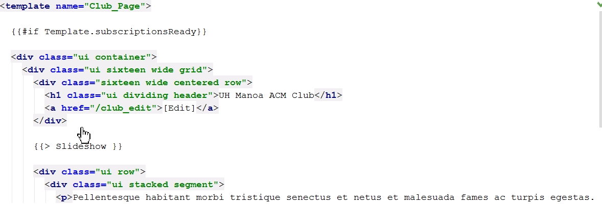

in software engineering, there are numerous different way to approach the same problem. Young software engineers, like me, who haven't learned of design pattern often say, as long as it works correctly, it is fine. However, in real life and work, how to approach the problem substantially increase or decrease the development process. Design patterns are the solution to general problems that have encountered by many software developers and those design patterns are obtained and updated over quite a long period of time. in the design pattern, there are three big categorized patterns: creational, structural, and behavioral pattern. 

- Creational design patterns are responsible for efficient object creation mechanisms, which increase the flexibility and reuse of existing code.

- Structural design patterns are responsible for building simple and efficient class hierarchies and relations between different classes.

- Behavioral patterns are responsible for the efficient and safe distribution of behaviors among the program's objects.

there are many different pattern in each categories but today, I would like to show design patterns that I used on project named Squadify.

<b>Singleton</b> is creational design pattern that provides one instance when the class is created and gives a global access to the instance. in the project, Squadify, singleton method is implemented in the Mango DB that each collection provides one instance of its collection. here is the example of implementation. 

we created the instance in the class named clubprofilecollection itself and then exports the instance so that any class can access to the instance variable globally by just importing the class file. Since data has to be consistent, we need to ensure that we are referring one and only instance everytime we access it. otherwise, it could provide inconsistent data to a user by unintended human error. 

<b>Template</b> method is a behavior design pattern that often used in framework design like web development.  The idea of template method is similar to the singleton method. 

Blaze is already designed with template method that we just had to create a component, slideshow in this case, with template tag and implement it in subclass files. this method ensure that there would be no code overlap and it can be reused in the future.

<b>Reactive</b> data is observer design pattern that any code that refers to the data will be re-run when the data is updated or changed. It is very useful and important when you are working with the database. Meteor uses this method to re-run webpage on the user's browser when the website is updated.

In Squadify, I used this method in the slideshow to count current index number. the benefit of this method is that it allows sending data to other objects effectively without any change in the Subject or Observer classes.
