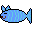
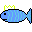
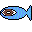
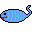

These are pixel art for my game that I drew when I bought a program called sprite on steam. I had a class which I had to post what I did for every week. I decied to try pixel art since I have unfinished game and kind of wanted to see how far I could learn from online. 

Sprite program was pretty easy to use. However I couldn't use it well since I don't have any art background and I have lack of color sense that whatever I draw was like a drawing of a5 years old kid but I loved it.
